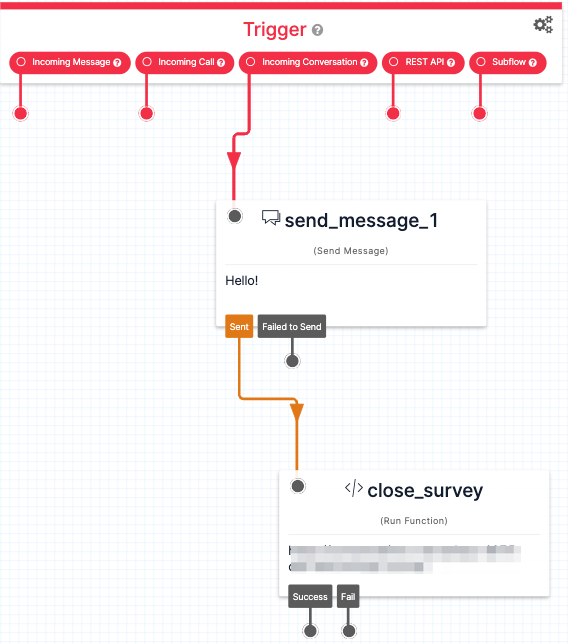

# Post Task Survey Flex Plugin

This Flex plugin enables sending surveys(e.g. CSAT survey) after a task is completed or the agent hangs up. Currently, it works for **WhatsApp** and **Voice** tasks.

## Requirements

* [Twilio CLI](https://www.twilio.com/docs/twilio-cli/quickstart)
* [Twilio CLI Flex Plugin Extension](https://www.twilio.com/docs/flex/developer/plugins/cli)
* [Twilio Serverless Toolkit](https://www.twilio.com/docs/labs/serverless-toolkit)
* [Twilio Flex UI 2.0](https://www.twilio.com/docs/flex/developer/ui/v2)
* [Pulumi CLI](https://www.pulumi.com/docs/reference/cli/) (required for deploying using Infrastructure-as-Code)


## Usage

### Setting up Twilio Studio, TaskRouter and Flex Insights to register Survey scores

The step-by-step guide on how to set up the *conversation ID* from **Twilio Studio** and how to creat **Task Channels** and **Task Queues** for Survey tasks can be found in this [Twilio Blog Post](https://www.twilio.com/blog/post-task-surveys-with-flex-insights)

### Customizing Text Surveys

#### Creating a Custom Survey Flow

The functions included with this plugin handle a very basic survey response. If you wish to add more messages or create a more complex flow, just add the custom logic to the **Studio Flow** that processes the survey.

#### Changing Survey Message

The content of the first message to be sent to the user is defined through *Flex Configuration*. To change it, just change the `postTaskSurveyMessage` parameter in the `appConfig.js` file.

#### Customize Survey Timeout

Survey timeout is defined in hours through the `SURVEY_CLOSE_AFTER_HOURS` environment variable, present in the **Serverless Service**

> **IMPORTANT:** It's not recommended to leave the survey without a timeout, as it can seriously hurt user experience if the end user decides to ignore the survey and has a new enquiry later. If your use case **MUST** leave the survey without a timeout, just leave the environment variable set as `0`

### Customizing Voice Surveys

#### Changing Strings

Voice survey strings are defined in the `survey-strings.json` file. You can define your own content there, including the first message, a thank you message and the message to be played in the case of a wrong input,

#### Replacing Text-to-Speech messages for Pre-Recorded Audio

Replace instances of `TwiML <Say>` within the code for `TwiML <Play>`, referencing the pre-recorded audio public URL. You can also include the audio files as assets within the **Serverless Service**, if you wish to keep the URLs private.

### Processing Survey Answers

Within the **Studio Flow** used for processing answers, add the `close-survey` function in the end, passing as parameters:

| Parameter | Description                                                                                                                                                  |
| :---------------- | :----------------------------------------------------------------------------------------------------------------------------------------------------------- |
| originalTaskSid | Identifier for the original task. It's set as a *conversation attribute* and can be found at `{{trigger.conversation.ChannelAttributes.taskSid}}`                                   |
| conversationSid |Identifier for the survey conversation. Can be found at `{{trigger.conversation.ConversationSid}}`                            |
| surveyMeasure | The measure for the survey. Can be the first reply or whatever content you define as final |



## Setup using Pulumi (recommended)


If you wish to deploy this plugin using [Pulumi](https://www.pulumi.com/), you can find below how to do it. We recommend this approach, as you are going to have better control of project components , easily handling different environments, such as DEV and PROD, without worrying with manual deployment.

Furthermore, using Pulumi will take care of most Console setup, meaning that the setup will definitely be faster

### Pulumi CLI

After installing the CLI, you need to login using `pulumi login`. By default, this will log in to the managed Pulumi service backend. If you prefer to log in to a self-hosted Pulumi service backend, specify a URL. For more information, please refer to this [link](https://www.pulumi.com/docs/reference/cli/pulumi_login/). Also, check the `State and Backends` section to understand how states are handled.

#### How to Deploy

1. Run `cd pulumi` in the project root folder
2. Create you Pulumi project file by copying the example (`cp Pulumi.example.yaml Pulumi.yaml`) and setting name, runtime (keep as it is) and description.
3. Create the Pulumi stack for your current environment. For example, for dev you can run `pulumi stack init dev`.
4. For development environment, you should copy the .dev.env.example (`cp .env.example .dev.env`) and fill out the variables.

To deploy, make sure that you're pointing to the right account by running:

```bash
export TWILIO_ACCOUNT_SID=<YOUR ACCOUNT SID>
export TWILIO_AUTH_TOKEN=<YOUR AUTH TOKEN>
export FIND_BEFORE_CREATE=true
```

The last environment variable is particularly important because Flex pre-creates a bunch o services, and this will avoid conflicts.

Then, run `pulumi up` and confirm the settings.

> **IMPORTANT:** The *Flex Plugin* IS NOT deployed with Pulumi, to allow you to keep better version control. To deploy the plugin, please follow the [manual steps](###Plugin)

> **STUDIO FLOWS:** To allow users to change Studio Flows, they're not deployed or connected to Functions using Pulumi. please refer to the [usage guide](##Usage) to understand how to use Studio with Functions


## Manual Setup

### Serverless Service

The plugin includes a service used to send and process surveys using **Twilio Functions**. To deploy it, follow the procedure below:

```bash
cd survey-serverless
```

```bash
cp .env.example .env
```

Fill the `.env` file with you Segment account info:

| Config&nbsp;Value | Description                                                                                                                                                  |
| :---------------- | :----------------------------------------------------------------------------------------------------------------------------------------------------------- |
| TWILIO_WORKSPACE_SID | TaskRouter Workspace identifier. Obtainable in the [Console](https://console.twilio.com/us1/develop/taskrouter/workspaces).                                    |
| TWILIO_SURVEY_WORKFLOW_SID | The TaskRouter Workflow identifier for the workflow created to route Survey tasks                             |
| TWILIO_SURVEY_FLOW_SID | The identifier for a **Studio Flow** used to process survey answers |
| TWILIO_WHATSAPP_NUMBER | Whatsapp number to send the survey |
| SURVEY_CLOSE_AFTER_HOURS | Survey timeout (in hours) |
| TWILIO_SERVERLESS_BASE_URL | Serverless Base URL, used to process voice surveys. Will be empty at first deploy, to be filled afterwards |
| SURVEY_LANGUAGE | [Language](https://www.twilio.com/docs/voice/twiml/say#attributes-alice) to be used on Survey Text-to-Speech. Defaults to en-US |


Run

```bash
twilio serverless:deploy
```

The first deployment will generate a domain. **Copy it**. Paste it in the `TWILIO_SERVERLESS_BASE_URL` environment variable.

Run

```bash
twilio serverless:deploy
```

again.

### Plugin

Make sure you have [Node.js](https://nodejs.org) as well as [`npm`](https://npmjs.com). We support Node >= 10.12 (and recommend the _even_ versions of Node). Afterwards, install the dependencies by running `npm install`:

```bash
cd plugin-post-task-survey

# If you use npm
npm install
```

Copy the environment file example into a usable one.

```bash
cp .env.example .env
cp public/appConfig.example.js public/appConfig.js
```

Fill out the `.env` file with `FLEX_APP_SURVEY_FUNCTIONS_BASE`, using the Serverless Domain you copied from the Service deployment


Finally, to deploy the plugin, run

```bash
twilio flex:plugins:deploy
```

You can also run the plugin locally for testing purposes:

```bash
twilio flex:plugins:start
```

This will start a local instance of Flex at port `3000`


## Development

Run `twilio flex:plugins --help` to see all the commands we currently support. For further details on Flex Plugins refer to our documentation on the [Twilio Docs](https://www.twilio.com/docs/flex/developer/plugins/cli) page.

